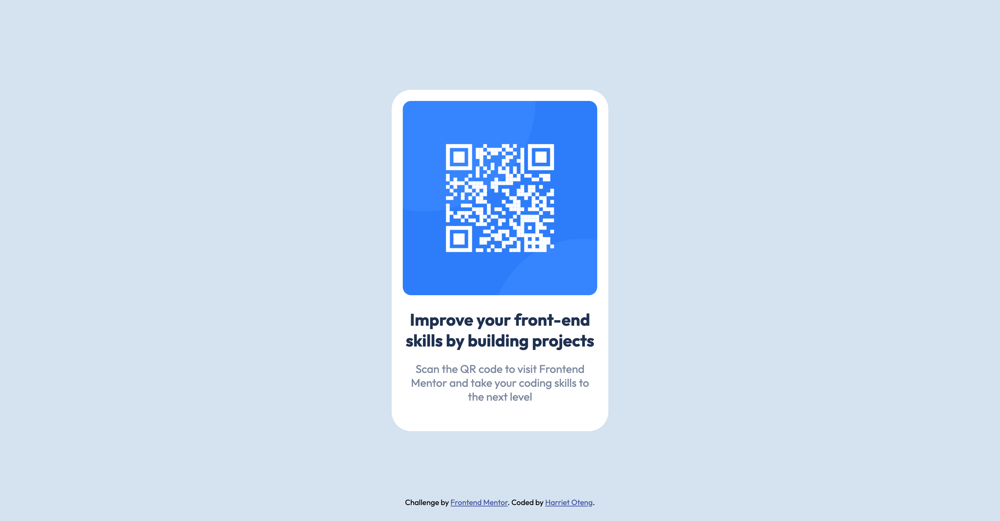

# Frontend Mentor - QR code component solution

This is a solution to the [QR code component challenge on Frontend Mentor](https://www.frontendmentor.io/challenges/qr-code-component-iux_sIO_H). Frontend Mentor challenges help you improve your coding skills by building realistic projects. 

## Table of contents

- [Overview](#overview)
  - [Screenshot](#screenshot)
  - [Links](#links)
- [My process](#my-process)
  - [Built with](#built-with)
- [Author](#author)

## Overview

### Screenshot

<!--  -->
<!--  -->
<!--  -->

### Links

- Solution URL: [Code](https://github.com/newhoteng/QR-code)
- Live Site URL: [Site](https://newhoteng.github.io/QR-code/)

## My process

### Built with

- Semantic HTML5 markup
- Flexbox
- Mobile-first workflow

## Author

<!-- - Website - [Add your name here](https://www.your-site.com) -->
- Frontend Mentor - [@newhoteng](https://www.frontendmentor.io/profile/newhoteng)
- Twitter - [@HarrietOteng1](https://twitter.com/HarrietOteng1)

